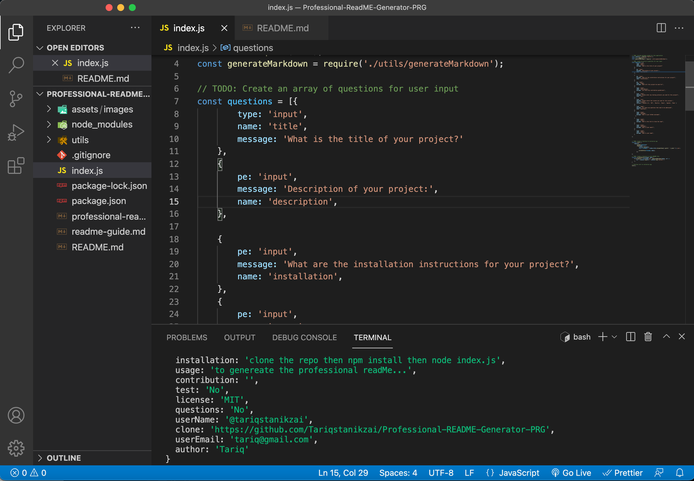
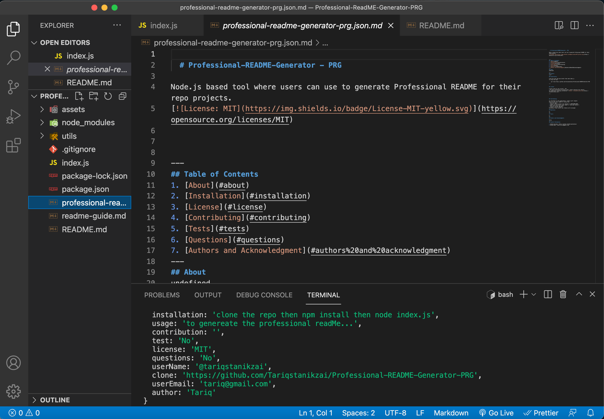

# Professional-README-Generator - PRG

### Github: https://github.com/Tariqstanikzai/Professional-README-Generator-PRG

### Walkthrough video: 
https://app.castify.com/view/1173be6e-0112-4071-908d-a06bf6df96d9

## Description
Node.js based tool where users can use to generate Professional README for their repo projects.

## User Story

- AS A developer
- I WANT a README generator
- SO THAT can quickly create a professional README for a new project

## Usage
- This tool will allow user to create a README.md
- Users will be asked to enter their Github username
- Users will be asked to enter their email
- Users need to provide the title of the project
- Users can describe the project
- Users will need to provide license if there's any
- Users will be asked if there's any dependencies
- Users will be asked if there's a test to run
- Users need to provide the usage of the project
- Last but not least, list the contributors

## Screenshots

## Technologies Use

<a href="https://nodejs.org/">Node.js</a>

<a href="https://www.npmjs.com/">NPM</a>

<a href="https://www.npmjs.com/package/inquirer">Inquirer.js</a>

## Contributor:
Tariq ©2020 All Rights Reserved.
- - -

